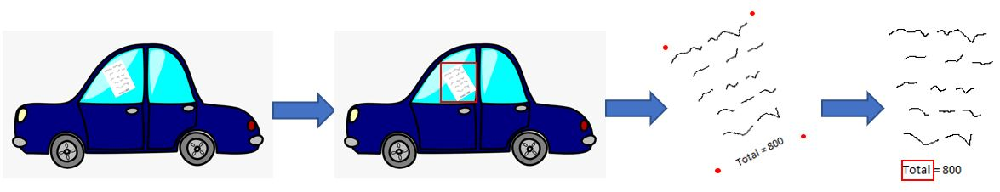
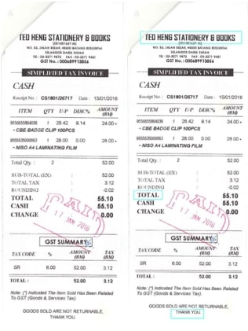
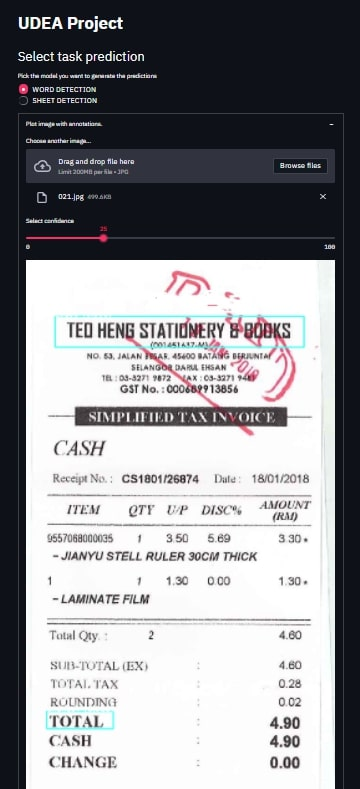
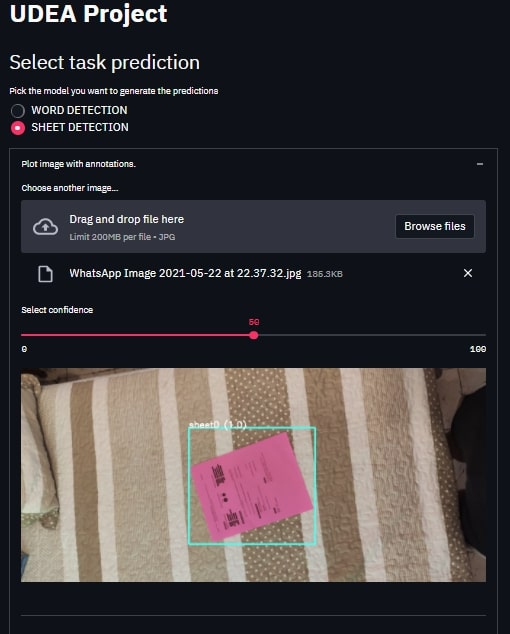

# Monografía – Especialización en Analítica y ciencia de datos

## Presentado por:

- Danilo Diaz Valencia

- Santiago Jaramillo 

- Julian Eusse Jaramillo

## Identificación de Etiquetas en Líneas de Manufactura

Este repo es un guía para la ejecución demo del proyecto Identificación de etiquetas en líneas de manufactura.


-------------------------------------------------------------------------
Resumen
<p align="center">
  
</p>

--------------------------------------------------------------------------
- Detección de Hoja

<p align="center">
  
</p>
---------------------------------------------------------------------------------

- Reorientación de Hoja
---------------------------------------------------------------------------------
- Detección de Palabra

<p align="center">
  
</p>

-----------------------------------------------------------------------------------

## Tabla de contenido

1. Requerimientos
2. Steps
3. Docker Image

## Requerimientos

### Instalar TensorFlow

El primer paso es instalar TensorFlow-. Hay muchos videos geniales en YouTube que brindan más detalles sobre cómo hacer esto y recomiendo echar un vistazo a este [video](https://www.youtube.com/watch?v=oqd54apcgGE) y [guía](https://github.com/armaanpriyadarshan/Training-a-Custom-TensorFlow-2.X-Object-Detector) visualización de cómo hacerlo. Los requisitos para TensorFlow-GPU son Anaconda, CUDA y cuDNN. Los dos últimos, CUDA y cuDNN  , son necesarios para utilizar la memoria gráfica de la GPU y cambiar la carga de trabajo aunque también se puede usar Tensorflow normal pero esto retrasar entrenamiento y procesos . Mientras tanto, Anaconda es lo que usaremos para configurar un entorno virtual donde instalaremos los paquetes necesarios.
```
conda create -n tensorflow pip python=3.8

```
Instalar tensorflow
```
pip install tensorflow
```
si está usando tensorflow GPU use
```
pip install tensorflow-gpu
```

### Instalar TensorFlow-Api
Para realizar los entrenamientos y los experimentos es necesario realizar la instalacion del api de TensorFlow y seleccionar un modelo [TensorFlow models repository](https://github.com/tensorflow/models)

```
git clone https://github.com/tensorflow/models.git

```

### Instalar Requerimientos

Estos son la librerias que se usaron para realizar todo el projecto.

```
pip install -r requirements.txt

```

## Descripcion.

Este repositorio contiene todos los experimentos realizados para logra la implementación del demo de detección de objetos. Dejaderos unos pasos de como realizamos el entrenamiento.

------------------------------------------------------------------------------------
Descargamos las imágenes que se encuentra almacenadas en Drive , tener muy encuant el tipo de Dataset Word_Detection/Sheet_detection

```
python 001_down_data.py --name_data=Word_Detection --name_path=data
python 001_down_data.py --name_data=Sheet_detection --name_path=data

```

Separamos los datos en train/test

```
python 002_train_test_val.py

```

Como las imágenes estaba etiquetadas en formato XML hay que realizar un proceso para convertirlo en un Dataset manipulable.
```
python 003_xml-to-csv.py

```

Generamos los tf_record [info](https://ichi.pro/es/cree-un-conjunto-de-datos-tfrecords-y-utilicelo-para-entrenar-un-modelo-de-aa-239861015448620#:~:text=TFRecord%20es%20un%20formato%20de,almacenar%20im%C3%A1genes%20y%20vectores%201D.&text=(iv)%20Im%C3%A1genes.,y%20escribir%20de%20forma%20secuencial.) 

```
python 004_generate_tfrecord.py -x data/train.csv -l data/annotations/Word_Detection/label_map.pbtxt -o data/annotations/Word_Detection/train.record -i data/train
python 004_generate_tfrecord.py -x data/test.csv -l data/annotations/Word_Detection/label_map.pbtxt -o data/annotations/Word_Detection/test.record -i data/test

```

Entrenamos modelo (Este enteramiento dura 4horas)


```
python model_main_tf2.py --model_dir=models/my_ssd_mobilenet_v2_fpnlite --pipeline_config_path=models/my_ssd_mobilenet_v2_fpnlite/pipeline.config
```

Exportamos modelo
```
python 006_export_model.py --input_type image_tensor --pipeline_config_path ./models/{namemodel}/pipeline.config --trained_checkpoint_dir ./models/{namemodel}/ --output_directory ./exported-models/prueba

```

Evaluamos modelo
```
  python3 ~/tensorflow_models/object_detection/eval.py --logtostderr --pipeline_config_path=ssd_mobilenet_v1_face.config  --checkpoint_dir=model_output --eval_dir=eval
```

## Docker
Para obtener la imagen de Docker use : 
```
  docker pull ddiazva312/object_detection
```
### Fast-Api

### Streamlit

<p align="left">
  
</p>
<p align="right">
  
</p>

